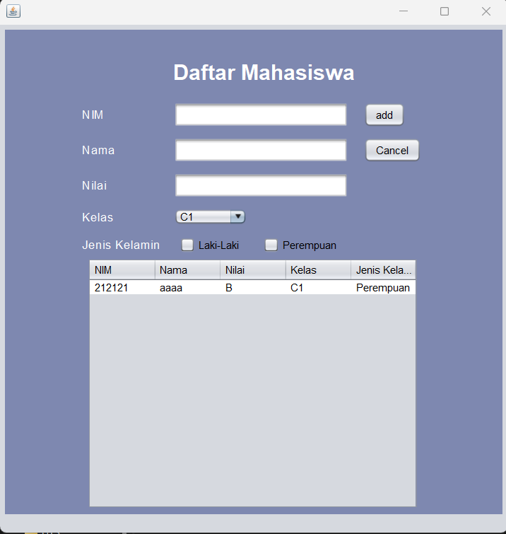

# LATIHAN5DPBO2023
## Janji
Saya Muhammad Cahyana Bintang Fajar NIM 2102665 mengerjakan Latihan 5 dalam mata kuliah Desain dan Pemrograman Berorientasi Objek untuk keberkahanNya maka saya tidak melakukan kecurangan seperti yang telah dispesifikasikan. Aamiin.

## Desain Program

* disini saya menambahkan 2 properti baru, yaitu comboBox dan juga 2 Checkbox yang di group menjadi satu, sehingga terdiri dari 5 atribut yaitu 3 textfield 1 combobox atau dropdown, 1 lagi checkbox
* checkbox ini di group menjadi satu, karena kita hanya bisa mengisi antara **Laki-Laki** dan **Perempuan**, tidak bisa keduanya
* untuk comboboxnya dropdown, hanya ada 2 item didalamnya yaitu **C1** dan **C2**

## Alur Program
### Add Data
* Untuk Menambahkan data, anda cukup isi 5 data, yaitu nim, nama, nilai, kelas, dan juga jenis kelamin
* disini jenis kelamin tidak boleh kosong, setelah anda menambahkan data, lalu formnya akan ter reset lagi dari awal
* setelah itu update table
* menampilkan dialog box data berhasil ditambahkan

### Update Data
* untuk mengupdate data, pertama tama anda harus mengisi data mana yang akan di update, setelah itu pilih di antara 5 kolom itu mana data yang ingin anda ubah
* jangan lupa untuk mengisi jenis kelaminnya, supaya tidak kosong
* setelah itu klik update lalu tabel akan ter update
* lalu menampilkan dialog box data berhasil di update

### Delete Data
* untuk mendelete data, anda pilih saja data mana yang ingin anda delete
* setelah itu, klik delete
* akan muncul confirmation form, data ingin didelete atau tidak, jika iya maka data terdelete, jika tidak, maka data tidak terdelete
* lalu menampilkan table yang ter update
* reset form
* menampilkan dialog box data berhasil di hapus

## Dokumentasi
### jenis kelamin tidak boleh kosong

### data setelah ditambah

### data setelah di update

### confirmation delete

### data setelah di hapus

